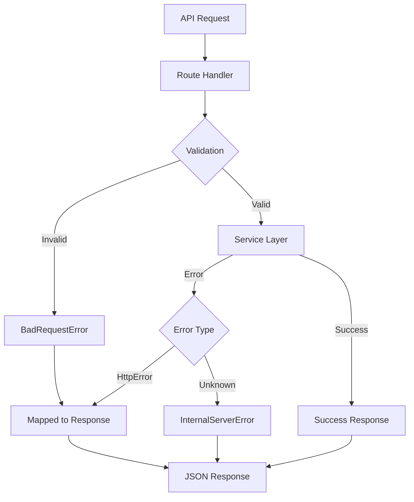

# API Foundation Architecture

This document describes the API infrastructure for the CareFi Next.js application. This foundation provides a consistent, secure, and maintainable pattern for building API endpoints.

## Table of Contents

- [Overview](#overview)
- [Folder Structure](#folder-structure)
- [Core Concepts](#core-concepts)
- [Error Handling](#error-handling)
- [Response Envelopes](#response-envelopes)
- [Validation](#validation)
- [Adding New Endpoints](#adding-new-endpoints)
- [Security Considerations](#security-considerations)
- [Why This Design](#why-this-design)

## Overview

The API foundation provides:

- **Type-safe environment management** - Validates env vars at startup
- **Centralized error handling** - Consistent error responses across all endpoints
- **Response envelopes** - Predictable JSON structure for success and error responses
- **Request validation** - Zod schemas for type-safe input validation
- **Route handler builder** - Reduces boilerplate and enforces patterns
- **Service layer** - Pure business logic separated from HTTP concerns
- **Security utilities** - Password hashing, input sanitization

## Folder Structure

```
carefi/
├── app/
│   └── api/
│       └── signup/
│           └── route.ts              # POST /api/signup endpoint
│
├── lib/
│   ├── env.ts                        # Environment variable loader
│   │
│   ├── http/
│   │   ├── errors.ts                 # HTTP error classes
│   │   ├── response.ts               # Response envelope helpers
│   │   └── handler.ts                # Route handler builder
│   │
│   ├── validation/
│   │   └── auth.ts                   # Zod schemas for auth
│   │
│   ├── security/
│   │   └── passwords.ts              # Password hashing utilities
│   │
│   ├── supabase/
│   │   └── server.ts                 # Supabase admin client
│   │
│   └── users/
│       └── service.ts                # User business logic
│
├── docs/
│   ├── API_FOUNDATION.md             # This file
│   └── SIGNUP_ENDPOINT.md            # Signup implementation guide
│
├── openapi.yaml                      # OpenAPI specification
│
└── examples/
    └── rest/
        └── signup.http               # REST client examples
```

## Core Concepts

### 1. Environment Variables (`lib/env.ts`)

Type-safe environment variable loader that validates required variables at startup.

```typescript
import { env } from '@/lib/env';

// Throws if SUPABASE_URL or SUPABASE_SERVICE_ROLE_KEY are missing
const client = createClient(env.SUPABASE_URL, env.SUPABASE_SERVICE_ROLE_KEY);
```

**Required Environment Variables:**
- `SUPABASE_URL` - Supabase project URL
- `SUPABASE_SERVICE_ROLE_KEY` - Supabase service role key (server-only)

### 2. HTTP Error Classes (`lib/http/errors.ts`)

Typed error classes that map to HTTP status codes with stable error codes.

```typescript
import { ConflictError, ErrorCodes } from '@/lib/http/errors';

// Throw typed errors in your code
throw new ConflictError('Email already registered', ErrorCodes.EMAIL_IN_USE);

// Automatically converted to:
// {
//   "success": false,
//   "error": {
//     "code": "conflict/email_in_use",
//     "message": "Email already registered"
//   }
// }
```

### 3. Response Envelopes (`lib/http/response.ts`)

Standardized JSON response structure for all API endpoints.

**Success Response:**
```json
{
  "success": true,
  "data": { "id": "123", "email": "user@example.com" }
}
```

**Error Response:**
```json
{
  "success": false,
  "error": {
    "code": "bad_request/invalid_input",
    "message": "Invalid input",
    "details": { "email": "Invalid email address" }
  }
}
```

### 4. Route Handler Builder (`lib/http/handler.ts`)

Reduces boilerplate by providing a wrapper for Next.js API routes.

```typescript
import { createPostHandler } from '@/lib/http/handler';
import { created } from '@/lib/http/response';
import { signupSchema } from '@/lib/validation/auth';

export const POST = createPostHandler(signupSchema, async (req, body) => {
  // body is typed and validated
  const user = await createUser(body);
  return created(user);
});
```

**Features:**
- Method enforcement (GET, POST, PUT, DELETE)
- Automatic JSON parsing with size limits (1MB)
- Zod schema validation
- Centralized error handling
- Request ID generation for tracing

### 5. Validation Schemas (`lib/validation/auth.ts`)

Zod schemas for type-safe request validation.

```typescript
import { signupSchema, type SignupInput } from '@/lib/validation/auth';

const result = signupSchema.safeParse(body);
if (!result.success) {
  // Validation failed
  const errors = formatZodError(result.error);
}

// TypeScript type automatically inferred
const input: SignupInput = result.data;
```

### 6. Service Layer (`lib/users/service.ts`)

Pure business logic functions separated from HTTP concerns.

```typescript
import { createUser } from '@/lib/users/service';

const user = await createUser({
  email: 'user@example.com',
  password: 'SecurePass123',
  displayName: 'John Doe',
});
```

**Benefits:**
- Framework-agnostic (no Next.js imports)
- Easy to test in isolation
- Reusable across different endpoints
- Clear separation of concerns

## Error Handling

### Error Taxonomy

| HTTP Status | Error Class | Error Code Pattern | When to Use |
|-------------|-------------|-------------------|-------------|
| 400 | `BadRequestError` | `bad_request/*` | Invalid input, malformed JSON |
| 401 | `UnauthorizedError` | `unauthorized/*` | Missing or invalid authentication |
| 403 | `ForbiddenError` | `forbidden/*` | Authenticated but lacks permission |
| 404 | `NotFoundError` | `not_found/*` | Resource doesn't exist |
| 409 | `ConflictError` | `conflict/*` | Duplicate resource, state conflict |
| 500 | `InternalServerError` | `internal/*` | Unexpected server errors |

### Common Error Codes

```typescript
// Validation errors
bad_request/invalid_input     // Zod validation failed
bad_request/invalid_json      // Malformed JSON body
bad_request/payload_too_large // Request body exceeds 1MB

// Authentication errors
unauthorized/missing_credentials  // No auth token provided
unauthorized/invalid_credentials  // Invalid email/password

// Conflict errors
conflict/email_in_use         // Email already registered

// Server errors
internal/server_error         // Unexpected error
internal/database_error       // Database operation failed
```

### Error Flow



## Response Envelopes

All API responses follow the envelope pattern for consistency.

### Success Responses

**200 OK** - Successful GET or general success
```typescript
return ok({ user: { id: '123', email: 'user@example.com' } });
```

**201 Created** - Resource created successfully
```typescript
return created({ id: '123', email: 'user@example.com' });
```

### Error Responses

**400 Bad Request** - Validation errors
```typescript
return badRequest('Invalid input', {
  email: 'Invalid email address',
  password: 'Password must be at least 8 characters'
});
```

**409 Conflict** - Duplicate resource
```typescript
return conflict('Email already registered', 'conflict/email_in_use');
```

**500 Internal Server Error** - Unexpected errors
```typescript
return internalServerError('Failed to create user');
```

## Validation

Validation is handled by Zod schemas defined in `lib/validation/`.

### Example Schema

```typescript
export const signupSchema = z.object({
  email: z.string().email().toLowerCase().trim(),
  password: z.string()
    .min(8, 'Password must be at least 8 characters')
    .regex(/[a-zA-Z]/, 'Password must contain at least one letter')
    .regex(/[0-9]/, 'Password must contain at least one number'),
  displayName: z.string().trim().max(80).optional().nullable(),
});

export type SignupInput = z.infer<typeof signupSchema>;
```

### Validation Flow

1. Request body is parsed from JSON
2. Zod schema validates the data
3. If validation fails, returns 400 with field-level errors
4. If validation succeeds, handler receives typed data

## Adding New Endpoints

Follow these steps to add a new API endpoint:

### 1. Define Validation Schema

Create or update a schema in `lib/validation/`:

```typescript
// lib/validation/auth.ts
export const loginSchema = z.object({
  email: z.string().email().toLowerCase().trim(),
  password: z.string(),
});

export type LoginInput = z.infer<typeof loginSchema>;
```

### 2. Create Service Functions

Add business logic to a service module in `lib/`:

```typescript
// lib/users/service.ts
export async function authenticateUser(input: LoginInput): Promise<UserProfile> {
  // 1. Find user by email
  // 2. Verify password hash
  // 3. Return user profile or throw error
}
```

### 3. Create API Route

Create a route file in `app/api/`:

```typescript
// app/api/login/route.ts
import { createPostHandler } from '@/lib/http/handler';
import { ok } from '@/lib/http/response';
import { loginSchema } from '@/lib/validation/auth';
import { authenticateUser } from '@/lib/users/service';

export const dynamic = 'force-dynamic';

export const POST = createPostHandler(loginSchema, async (req, body) => {
  const user = await authenticateUser(body);
  return ok({ user });
});
```

### 4. Update OpenAPI Spec

Add the new endpoint to `openapi.yaml`:

```yaml
/api/login:
  post:
    summary: Authenticate user
    requestBody:
      required: true
      content:
        application/json:
          schema:
            $ref: '#/components/schemas/LoginRequest'
    responses:
      '200':
        description: Login successful
        content:
          application/json:
            schema:
              $ref: '#/components/schemas/LoginResponse'
```

### 5. Add Examples

Create REST client examples in `examples/rest/`:

```http
### Login
POST http://localhost:3000/api/login
Content-Type: application/json

{
  "email": "user@example.com",
  "password": "SecurePass123"
}
```

## Security Considerations

### 1. Never Log Secrets

```typescript
// ❌ BAD - Logs plaintext password
console.log('User signup:', { email, password });

// ✅ GOOD - Sanitizes before logging
console.log('User signup:', { email, password: '[REDACTED]' });
```

### 2. Use Service Role Key Safely

```typescript
// ❌ BAD - Exposes service role key to client
export const SUPABASE_KEY = process.env.SUPABASE_SERVICE_ROLE_KEY;

// ✅ GOOD - Only used in server-side code
import { env } from '@/lib/env'; // Server-only module
```

### 3. Hash Passwords

```typescript
// ❌ BAD - Stores plaintext password
await db.insert({ email, password });

// ✅ GOOD - Stores bcrypt hash
const hash = await hashPassword(password);
await db.insert({ email, password: hash });
```

### 4. Enforce Request Size Limits

The route handler automatically enforces a 1MB request size limit to prevent DoS attacks.

### 5. Validate All Inputs

All request bodies are validated with Zod schemas before processing.

## Why This Design?

### 1. Consistency

All endpoints follow the same patterns:
- Same response structure
- Same error handling
- Same validation approach

This makes the API predictable and easy to use.

### 2. Type Safety

TypeScript + Zod provide end-to-end type safety:
- Request validation generates TypeScript types
- Service functions are strongly typed
- Response helpers ensure correct response structure

### 3. Separation of Concerns

- **Route handlers** - HTTP concerns (parsing, validation, responses)
- **Service layer** - Business logic (creating users, authenticating, etc.)
- **Utilities** - Shared functionality (hashing, error handling, etc.)

### 4. Testability

Service functions are pure and framework-agnostic, making them easy to test:

```typescript
// No mocking Next.js required
import { createUser } from '@/lib/users/service';

test('creates user with valid input', async () => {
  const user = await createUser({
    email: 'test@example.com',
    password: 'SecurePass123',
    displayName: 'Test User',
  });

  expect(user.email).toBe('test@example.com');
});
```

### 5. Error Handling

Centralized error handling ensures:
- Consistent error responses
- No leaked error details in production
- Request tracing with X-Request-ID
- Proper HTTP status codes

### 6. Developer Experience

- Less boilerplate (route handler builder)
- Clear error messages
- Type inference (Zod → TypeScript)
- Comprehensive documentation

## Next Steps

1. **Add authentication middleware** - JWT validation for protected routes
2. **Add rate limiting** - Prevent abuse with rate limits per IP/user
3. **Add logging** - Structured logging with pino for production
4. **Add monitoring** - Error tracking with Sentry or similar
5. **Add caching** - Cache frequently accessed data with Redis
6. **Add API versioning** - Support multiple API versions (`/api/v1/`, `/api/v2/`)

## Resources

- [Next.js App Router Documentation](https://nextjs.org/docs/app)
- [Zod Documentation](https://zod.dev)
- [Supabase JavaScript Client](https://supabase.com/docs/reference/javascript)
- [bcrypt Documentation](https://github.com/kelektiv/node.bcrypt.js)
- [OpenAPI Specification](https://swagger.io/specification/)
