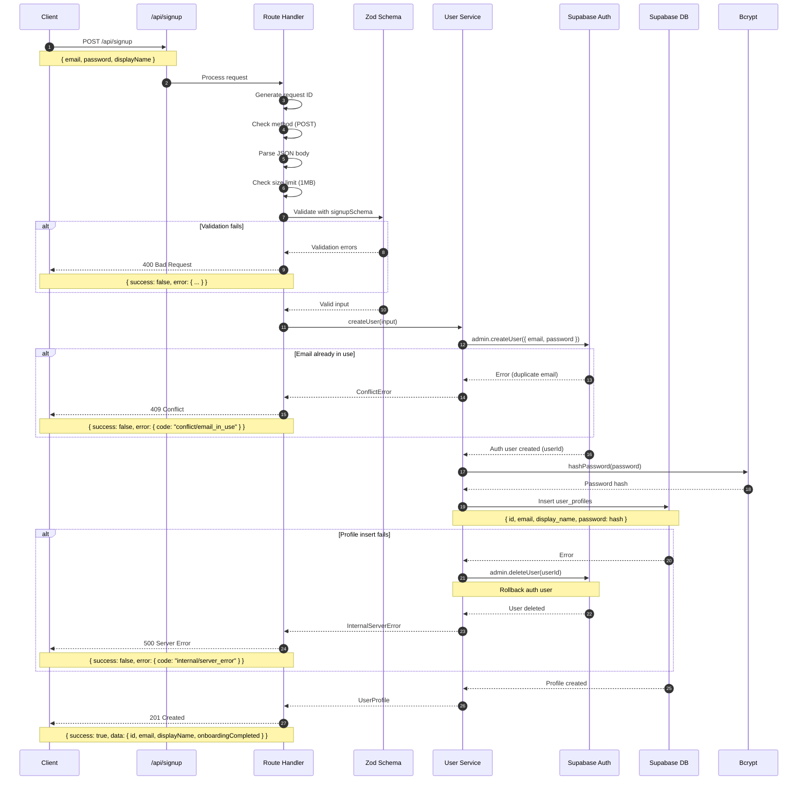

# POST /api/signup - User Signup Endpoint

Complete implementation guide for the user signup endpoint.

## Table of Contents

- [Overview](#overview)
- [Flow Diagram](#flow-diagram)
- [Request Specification](#request-specification)
- [Response Specification](#response-specification)
- [Implementation Details](#implementation-details)
- [Testing](#testing)
- [Common Failure Modes](#common-failure-modes)
- [Security Notes](#security-notes)

## Overview

The signup endpoint creates a new user account with email and password authentication. It performs the following operations:

1. Validates request body (email, password, displayName)
2. Creates a Supabase Auth user with auto-confirmed email
3. Hashes the password with bcrypt (12 rounds)
4. Stores the hash in `user_profiles.password`
5. Returns sanitized user data (no password or hash)
6. Rolls back auth user if profile creation fails

**Endpoint:** `POST /api/signup`

**Authentication:** None required (public endpoint)

**Rate Limiting:** Not implemented yet (recommended for production)

## Flow Diagram



## Request Specification

### Headers

```
Content-Type: application/json
```

### Body

```json
{
  "email": "user@example.com",
  "password": "SecurePass123",
  "displayName": "John Doe"
}
```

### Field Validation

| Field | Type | Required | Validation Rules |
|-------|------|----------|-----------------|
| `email` | string | Yes | - Valid email format<br>- Auto-lowercased<br>- Trimmed |
| `password` | string | Yes | - Minimum 8 characters<br>- At least 1 letter (a-z, A-Z)<br>- At least 1 number (0-9) |
| `displayName` | string | No | - Maximum 80 characters<br>- Trimmed<br>- Defaults to `null` if empty |

### Example Requests

**Minimal (no display name):**
```json
{
  "email": "user@example.com",
  "password": "SecurePass123"
}
```

**Complete:**
```json
{
  "email": "user@example.com",
  "password": "SecurePass123",
  "displayName": "John Doe"
}
```

## Response Specification

### Success Response (201 Created)

```json
{
  "success": true,
  "data": {
    "id": "550e8400-e29b-41d4-a716-446655440000",
    "email": "user@example.com",
    "displayName": "John Doe",
    "onboardingCompleted": false
  }
}
```

**Response Fields:**

| Field | Type | Description |
|-------|------|-------------|
| `id` | string (uuid) | Unique user identifier |
| `email` | string | User email (lowercased) |
| `displayName` | string \| null | User display name |
| `onboardingCompleted` | boolean | Always `false` for new users |

**Response Headers:**
```
X-Request-ID: req_1699564800000_abc123def
Content-Type: application/json
```

### Error Responses

#### 400 Bad Request - Validation Errors

```json
{
  "success": false,
  "error": {
    "code": "bad_request/invalid_input",
    "message": "Invalid input",
    "details": {
      "email": "Invalid email address",
      "password": "Password must be at least 8 characters"
    }
  }
}
```

**Common Validation Errors:**

| Field | Error Message |
|-------|--------------|
| email | "Email is required" |
| email | "Invalid email address" |
| password | "Password is required" |
| password | "Password must be at least 8 characters" |
| password | "Password must contain at least one letter" |
| password | "Password must contain at least one number" |
| displayName | "Display name must be 80 characters or less" |

#### 409 Conflict - Email Already in Use

```json
{
  "success": false,
  "error": {
    "code": "conflict/email_in_use",
    "message": "Email already registered"
  }
}
```

#### 413 Payload Too Large

```json
{
  "success": false,
  "error": {
    "code": "bad_request/payload_too_large",
    "message": "Request body exceeds 1048576 bytes"
  }
}
```

#### 500 Internal Server Error

```json
{
  "success": false,
  "error": {
    "code": "internal/server_error",
    "message": "Failed to create user account"
  }
}
```

## Implementation Details

### 1. Route Handler (`app/api/signup/route.ts`)

The route handler uses `createPostHandler` to reduce boilerplate:

```typescript
export const POST = createPostHandler(signupSchema, async (req, body) => {
  const user = await createUser(body);
  return created({
    id: user.id,
    email: user.email,
    displayName: user.displayName,
    onboardingCompleted: user.onboardingCompleted
  });
});
```

The handler automatically:
- Enforces POST method only
- Parses JSON body with 1MB size limit
- Validates against `signupSchema`
- Catches and formats errors
- Generates request ID

### 2. Service Layer (`lib/users/service.ts`)

The `createUser` function orchestrates the signup flow:

```typescript
export async function createUser(input: SignupInput): Promise<UserProfile> {
  // Step 1: Create auth user
  const authUserId = await createAuthUser(email, password);

  try {
    // Step 2: Hash password
    const passwordHash = await hashPassword(password);

    // Step 3: Insert profile
    await insertUserProfile(authUserId, email, displayName, passwordHash);

    return { id: authUserId, email, displayName, onboardingCompleted: false };
  } catch (error) {
    // Step 4: Rollback on failure
    await rollbackAuthUser(authUserId);
    throw error;
  }
}
```

**Key Functions:**

- `createAuthUser(email, password)` - Creates Supabase Auth user
- `hashPassword(password)` - Hashes password with bcrypt (12 rounds)
- `insertUserProfile(...)` - Inserts row into `user_profiles` table
- `rollbackAuthUser(userId)` - Deletes auth user if profile insert fails

### 3. Password Hashing (`lib/security/passwords.ts`)

Passwords are hashed with bcrypt using 12 salt rounds:

```typescript
export async function hashPassword(plainPassword: string): Promise<string> {
  const hash = await bcrypt.hash(plainPassword, 12);
  return hash;
  // Returns: $2a$12$R9h/cIPz0gi.URNNX3kh2OPST9/PgBkqquzi.Ss7KIUgO2t0jWMUW
}
```

**Security Notes:**
- Salt is automatically generated and embedded in the hash
- 12 rounds provides strong security (recommended for 2024+)
- Plaintext password is NEVER logged or stored

### 4. Database Schema

The `user_profiles` table stores user data:

```sql
CREATE TABLE public.user_profiles (
  id uuid NOT NULL,                                -- Matches auth.users.id
  created_at timestamp with time zone NOT NULL DEFAULT now(),
  updated_at timestamp with time zone NOT NULL DEFAULT now(),
  display_name text NULL,
  onboarding_completed boolean NOT NULL DEFAULT false,
  onboarding_completed_at timestamp with time zone NULL,
  email text NULL,
  password text NULL,                             -- bcrypt hash
  CONSTRAINT user_profiles_pkey PRIMARY KEY (id),
  CONSTRAINT user_profiles_id_fkey FOREIGN KEY (id)
    REFERENCES auth.users (id) ON DELETE CASCADE
);
```

**Foreign Key Constraint:**
- `user_profiles.id` references `auth.users.id`
- `ON DELETE CASCADE` ensures profile is deleted when auth user is deleted

## Testing

### cURL Examples

**Successful signup:**
```bash
curl -X POST http://localhost:3000/api/signup \
  -H "Content-Type: application/json" \
  -d '{
    "email": "user@example.com",
    "password": "SecurePass123",
    "displayName": "John Doe"
  }'
```

**Validation error (short password):**
```bash
curl -X POST http://localhost:3000/api/signup \
  -H "Content-Type: application/json" \
  -d '{
    "email": "user@example.com",
    "password": "short"
  }'
```

**Conflict error (duplicate email):**
```bash
# Run this twice to trigger conflict
curl -X POST http://localhost:3000/api/signup \
  -H "Content-Type: application/json" \
  -d '{
    "email": "duplicate@example.com",
    "password": "SecurePass123"
  }'
```

### VSCode REST Client

See `examples/rest/signup.http` for interactive examples.

### Manual Testing Checklist

- [ ] Valid signup creates user and returns 201
- [ ] User appears in `auth.users` table
- [ ] User appears in `user_profiles` table with hashed password
- [ ] Email is auto-lowercased
- [ ] Display name is trimmed
- [ ] Empty display name becomes `null`
- [ ] Duplicate email returns 409 conflict
- [ ] Short password (< 8 chars) returns 400
- [ ] Password without letter returns 400
- [ ] Password without number returns 400
- [ ] Invalid email format returns 400
- [ ] Missing email returns 400
- [ ] Missing password returns 400
- [ ] Request > 1MB returns 413
- [ ] Non-JSON body returns 400
- [ ] GET request returns 405

## Common Failure Modes

### 1. Email Already Registered

**Symptom:** 409 Conflict response

**Cause:** User with this email already exists in `auth.users`

**Resolution:** User should log in instead, or use password reset

**Example:**
```json
{
  "success": false,
  "error": {
    "code": "conflict/email_in_use",
    "message": "Email already registered"
  }
}
```

### 2. Profile Insert Fails

**Symptom:** 500 Internal Server Error

**Cause:** Database error when inserting into `user_profiles`

**Rollback:** Auth user is automatically deleted to maintain consistency

**Possible Causes:**
- Database connection issue
- Foreign key constraint violation
- Database permissions issue

**Example:**
```json
{
  "success": false,
  "error": {
    "code": "internal/server_error",
    "message": "Failed to create user profile"
  }
}
```

### 3. Weak Password

**Symptom:** 400 Bad Request

**Cause:** Password doesn't meet requirements

**Example:**
```json
{
  "success": false,
  "error": {
    "code": "bad_request/invalid_input",
    "message": "Invalid input",
    "details": {
      "password": "Password must contain at least one number"
    }
  }
}
```

### 4. Invalid Email Format

**Symptom:** 400 Bad Request

**Cause:** Email doesn't match email regex

**Example:**
```json
{
  "success": false,
  "error": {
    "code": "bad_request/invalid_input",
    "message": "Invalid input",
    "details": {
      "email": "Invalid email address"
    }
  }
}
```

## Security Notes

### 1. Password Security

✅ **What we do:**
- Hash passwords with bcrypt (12 rounds)
- Never log plaintext passwords
- Never return passwords or hashes in responses
- Store only hashes in the database

❌ **What we DON'T do:**
- Store plaintext passwords
- Log passwords in any form
- Return password hashes to clients
- Use weak hashing algorithms (MD5, SHA1)

### 2. Input Validation

✅ **What we do:**
- Validate all inputs with Zod schemas
- Sanitize inputs (trim, lowercase email)
- Enforce request size limits (1MB)
- Check for required fields

❌ **What we DON'T do:**
- Trust client input without validation
- Accept arbitrarily large payloads
- Skip type checking

### 3. Error Messages

✅ **What we do:**
- Return specific validation errors
- Use stable error codes for programmatic handling
- Include field-level error details

❌ **What we DON'T do:**
- Leak internal error details (stack traces, DB errors)
- Expose system information
- Return different errors for enumeration attacks (not implemented yet)

### 4. Rollback on Failure

✅ **What we do:**
- Delete auth user if profile insert fails
- Maintain consistency between `auth.users` and `user_profiles`
- Log rollback failures for monitoring

❌ **What we DON'T do:**
- Leave orphaned auth users without profiles
- Ignore rollback failures

## Future Enhancements

### 1. Email Verification

Currently, emails are auto-confirmed (`email_confirm: true`). For production:

- Send verification email instead
- Add `/api/verify-email` endpoint
- Update `signupSchema` to accept verification token

### 2. Rate Limiting

Add rate limiting to prevent abuse:

```typescript
import { rateLimit } from '@/lib/middleware/rate-limit';

export const POST = rateLimit({
  maxRequests: 5,
  windowMs: 15 * 60 * 1000, // 15 minutes
})(createPostHandler(signupSchema, handler));
```

### 3. Email Enumeration Protection

Return same response time for existing and non-existing emails:

```typescript
// Add artificial delay to prevent timing attacks
if (emailExists) {
  await sleep(100); // Random delay
  throw new ConflictError(...);
}
await sleep(100); // Same delay for non-existing emails
```

### 4. Password Strength Meter

Add frontend password strength indicator:

- Very weak (< 8 chars)
- Weak (8-10 chars, basic requirements)
- Medium (10-14 chars, mixed case)
- Strong (14+ chars, special characters)

### 5. CAPTCHA Protection

Add CAPTCHA to prevent automated signups:

```typescript
const captchaResult = await verifyCaptcha(body.captchaToken);
if (!captchaResult.success) {
  throw new BadRequestError('CAPTCHA verification failed');
}
```

## Related Endpoints

- `POST /api/login` - Authenticate existing user (to be implemented)
- `POST /api/logout` - End user session (to be implemented)
- `POST /api/password-reset` - Request password reset (to be implemented)
- `GET /api/me` - Get current user profile (to be implemented)

## Troubleshooting

### Issue: "Missing required environment variables"

**Cause:** `SUPABASE_URL` or `SUPABASE_SERVICE_ROLE_KEY` not set

**Solution:** Add to `.env` file:
```bash
SUPABASE_URL=https://xxx.supabase.co
SUPABASE_SERVICE_ROLE_KEY=eyJhbGc...
```

### Issue: "User created in auth but not in user_profiles"

**Cause:** Profile insert failed but rollback also failed

**Solution:** Manually delete orphaned user:
```sql
DELETE FROM auth.users WHERE id = 'orphaned-user-id';
```

### Issue: "Password hash not stored correctly"

**Cause:** Check `user_profiles.password` column type (should be `text`)

**Solution:** Verify bcrypt hash format starts with `$2a$12$` or `$2b$12$`

## Contact

For questions or issues with this endpoint, please refer to:
- [API_FOUNDATION.md](./API_FOUNDATION.md) - Overall API architecture
- [OpenAPI Spec](../openapi.yaml) - Formal API specification
